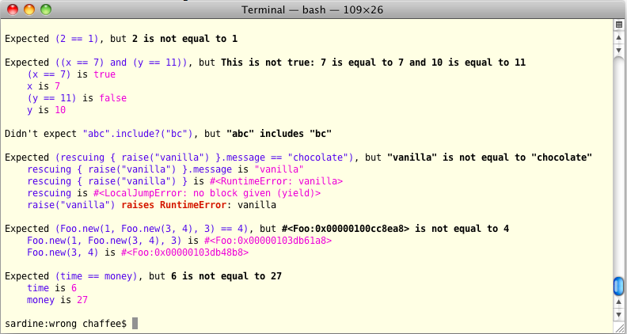

# Wrong


> The right way to assert

by Alex Chaffee <http://alexchaffee.com>

# In the beginning was ASSERT

```
ASSERT(x == 1)
```

but it's a C macro so whatever

# Then came xUnit

```
assert_true(x == 1)
```

# And then it kept coming...

```
assert(x)
assert_equal x, y
assert_nil x
assert_kind_of x.should equal(y)
assert_respond_to x, :to_y
assert_match /regex/, s
assert_same x, y
assert_operator x, :>=, y
assert_nothing_raised x
assert_not_same x,y
assert_not_equal x,y
assert_not_nil
assert_no_match regex, x
assert_throw
assert_throws
assert_nothing_thrown
assert_in_delta f, g, delta
assert_send [o, m, arg1, arg2]
assert_boolean x
assert_true x
assert_false x
assert_compare x, ">=", y
assert_fail_assertion { x }
assert_raise_message m, { x }
assert_const_defined Test, :Unit
assert_block { x }
assert_raise LoadError { x }
assert_raise { x }
assert_raise LoadError.new("why") { x } 
assert_raise(RuntimeError, LoadError) { x } 
assert_raise_kind_of(LoadError) { x } 
assert_instance_of(String, x)
```

# and coming...

```
x.should be_something(y)
x.should be_close(y, delta)
x.should be_instance_of y
x.should be_an_instance_of y
x.should be_true
x.should be_false
x.should be_nil
x.should == y
x.should exist
team.should have(11).players
[1,2,3].should have(3).items
x.should be_a_kind_of y"
"this string".should have(11).characters
x.should be_kind
x.should eql(y)
x.should have_at_least(number).items
x.should have_at_most(number).items
x.should include(y)
x.should match(/regex/)
lambda { do_something_risky }.should raise_exception
lambda { do_something_risky }.should
raise_exception(PoorRiskDecisionError) { |exception|
exception.data.should == 42 }
x.should respond_to(*names)
```

# and coming...

```
expect(x).to be_true
...
```

# Time Is Money (Test::Unit)

    assert_equal money, time

* verb ("equal") is in front
* direct and indirect objects (expected and actual) are reversed

# Time Is Money (RSpec)

    time.should eq(money)

* confusing syntax -- space vs. dot vs. underscore vs. parens
* what is `eq`? is it the same as `==` or `eql?` or `equal?`
* looks kind of readable, but "should" is inserted between parameters so it’s less apparent what the calculation is

# Time Is Money (Minitest)

    assert time == money
    
* Ah, now I see what you mean
* Default failure message is not helpful

        "Failed assertion, no message given.”
        
* Making the message helpful violates DRY

        assert time == money, "Time should equal money”

# Time Is Money (Wrong)

    assert { time == money }
    
* Failure message is helpful:

        Expected (time == money), but 6 is not equal to 27
            time is 6
            money is 27
        
# Deeper and deeper

    @@@ruby
    age = 24
    name = "Gaga"
    assert { age >= 18 && ["Britney", "Snooki"].include?(name) }
     ==>
    Expected ((age >= 18) and ["Britney", "Snooki"].include?(name)), but
        (age >= 18) is true
        age is 24
        ["Britney", "Snooki"].include?(name) is false
        name is "Gaga"

(Of course, this is a silly example; be concise in your assertions.)

# How do we do it?

* Magic
  * RubyParser and Ruby2Ruby by Ryan Davis
  * We turn the block into source code, parse it into an AST, break it down into parts, then convert back to code for the messages

* Also, we cheat
  * We open the source file on disk, jump to the right line, and parse it
  * If you’re constructing your tests with metaprogramming, you’ve got bigger problems than not being able to use Wrong


# Helpers

* rescuing {} 
* capturing {} 
* close_to?
* d
* eventually {}

# rescuing

For catching errors:

    assert{ rescuing{raise "vanilla"}.message == "chocolate" }
	 ==>
    Expected (rescuing { raise("vanilla") }.message == "chocolate"), but
        rescuing { raise("vanilla") }.message is "vanilla"
        rescuing { raise("vanilla") } is #<RuntimeError: vanilla>
        raise("vanilla") raises RuntimeError: vanilla

# capturing

For capturing output streams:

    assert { capturing { puts "hi" } == "hi\n" }
    assert { capturing(:stderr) { $stderr.puts "hi" } == "hi\n" }

    out, err = capturing(:stdout, :stderr) { ... }
    assert { out == "something standard\n" }
    assert { err =~ /something erroneous/ }

Or just swallowing them:

    capturing do
      something_loud
    end

# close_to?

If you want to compare floats, try this:

    assert { 5.0.close_to?(5.0001) }   # default tolerance = 0.001
    assert { 5.0.close_to?(5.1, 0.5) } # optional tolerance parameter

works with Rspec too

    1.0.should be_close_to(1.001)

# d

The most astounding debugging method ever!

`d` prints an expression *and its value* to the console!

    require 'wrong'
    x = 7
    
    d { x } 
    x is 7
    
    d { x * 2 }
    (x * 2) is 14
    
    d("math is hard") { 2 + 2 }
    math is hard: (2 + 2) is 4


# eventually

If you care that something is going to be true *soon*, but maybe not *right* now, use `eventually`.

    eventually { night? }

It will keep executing the block, up to 4 times a second, until either

  * the block returns true(ish)
  * 5 seconds elapse

You can also send options to eventually as hash parameters.

    eventually(:timeout => 10) { false } # keep trying for 10 sec
    eventually(:delay => 1) { false }    # try every 1.0 sec, not every 0.25 sec

# Compatible with...

* Minitest 
* RSpec
* Test::Unit 
* ???

# Explanations

```
assert("Earth's atmosphere disproportionately scatters low-wavelength photons") do
  sky.blue?
end
```

# Color

* Because COLOR!!!




# Info
* Authors
  * Steve Conover - <sconover@gmail.com> 
  * Alex Chaffee - <alex@stinky.com> - <http://alexch.github.com>
* Github: <http://github.com/alexch/wrong>
